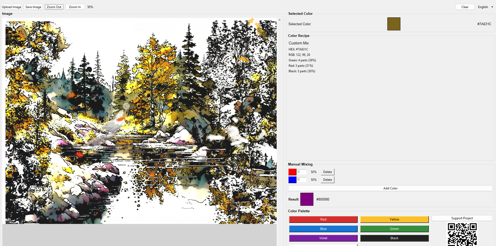

# MixLab — Color Picker & Mixer


**MixLab** is a free, offline color picker and mixer for artists, designers, painters, and anyone who works with colors.  
✅ No internet required  
✅ No ads  
✅ No tracking  
✅ No telemetry  
✅ 100% open-source (MIT License)

---

## ✨ Features

- 🎨 **Color palette** with base pigments (red, yellow, blue, etc.)
- 🖼️ **Load images** from your computer
- 🔍 **Eyedropper tool** — pick any color from an image
- 🔬 **Magnifier** — zoom into selected pixels
- 🧪 **Color mixing recipe** — see how to mix a color from base paints
- ➕ **Manual mixing** — create custom blends
- 🌍 **12 languages**: English, Русский, Español, Deutsch, Français, Italiano, Português, العربية, 中文, 日本語, Polski, Türkçe
- 💙 **Support the developer** via Ko-fi (optional)

---

## 📦 Download

Ready-to-use Windows executable:

👉 [Download MixLab.exe](https://github.com/andreas/mixlab/releases) *(update after publishing)*


> No installation needed. Just download and run!

---

## 🛠️ Build from Source

### Requirements
- Python 3.8+
- Git (optional)

### Steps
```bash
git clone https://github.com/andreas/mixlab.git
cd mixlab/src
pip install -r requirements.txt
python main.py